<h1 align="center">
  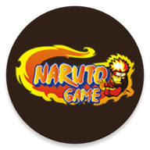  
</h1>

<h1 align="center">
  Naruto Game  
</h1>

In the game you will be a ninja and your mission is to develop your skills and chart your own ninja path to become Kage!

## Download
<a href="https://naruto-game.en.uptodown.com/android" target="_blank">
   
<a/>

## Table of contents
* [Download](#download)
* [Screenshots](#screenshots)
* [Contribute](#contribute)
* [Disclaimer](#disclaimer)

## Screenshots

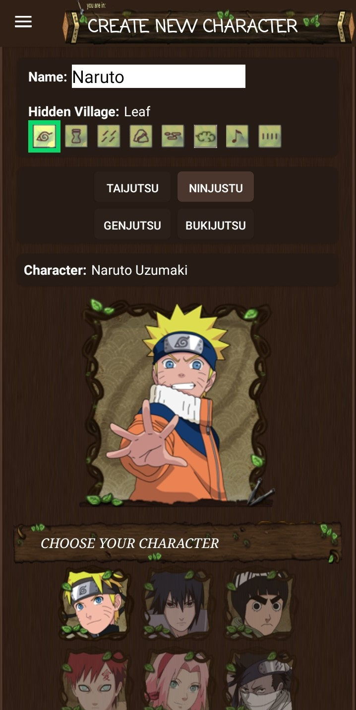
  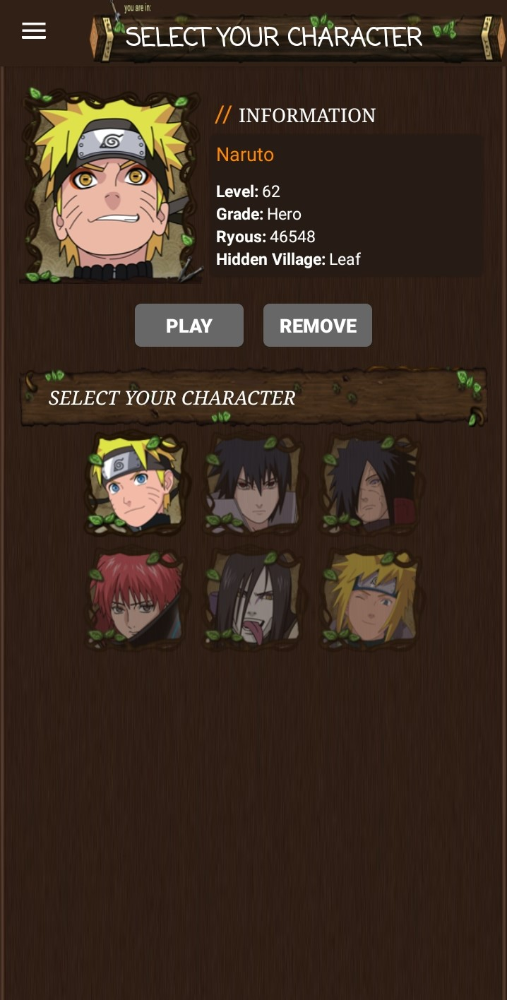
  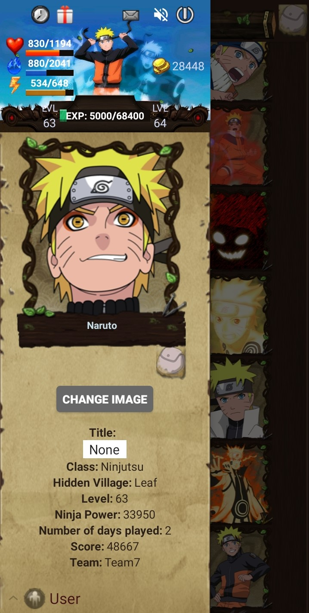
  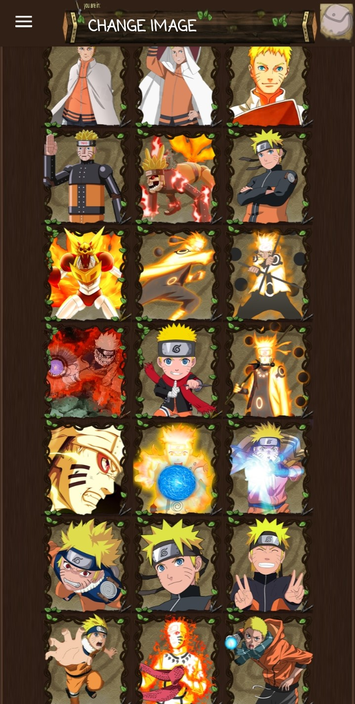
  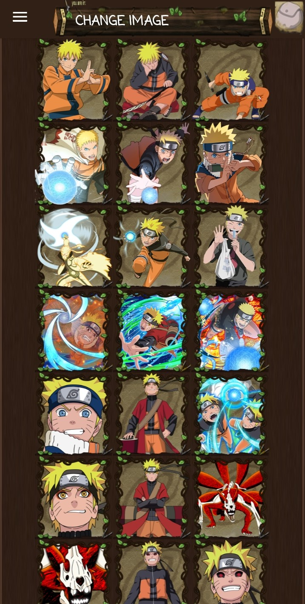
  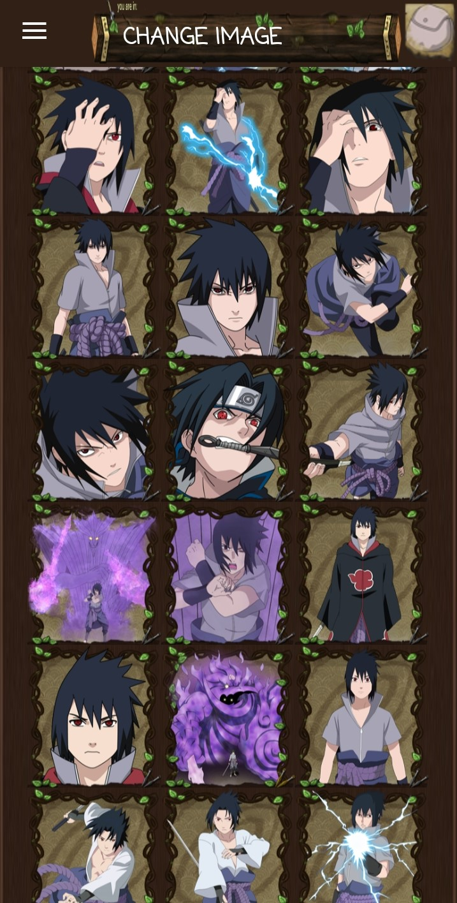
  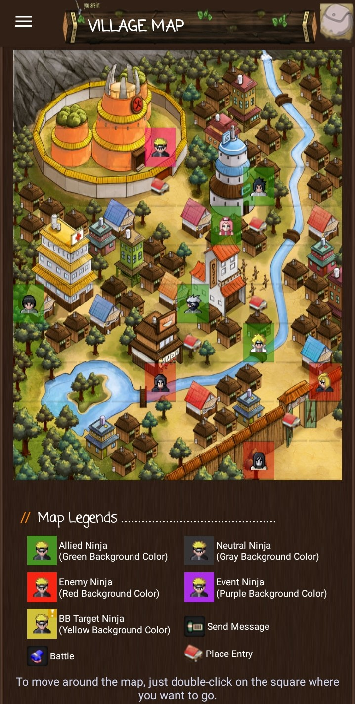
  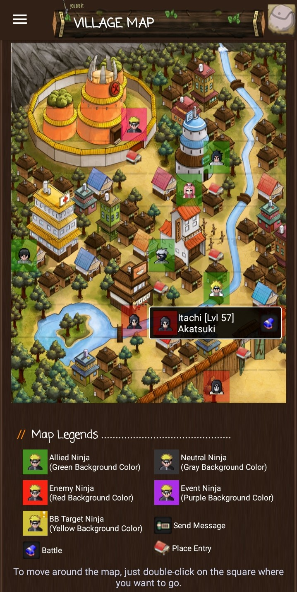
  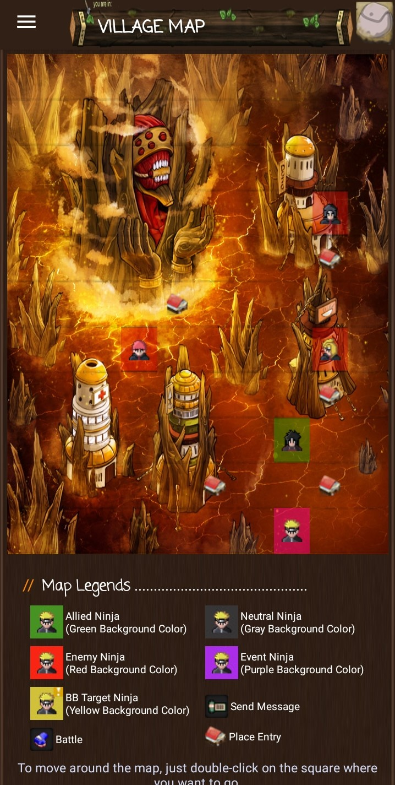
  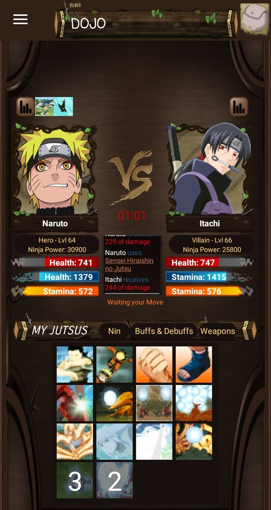
  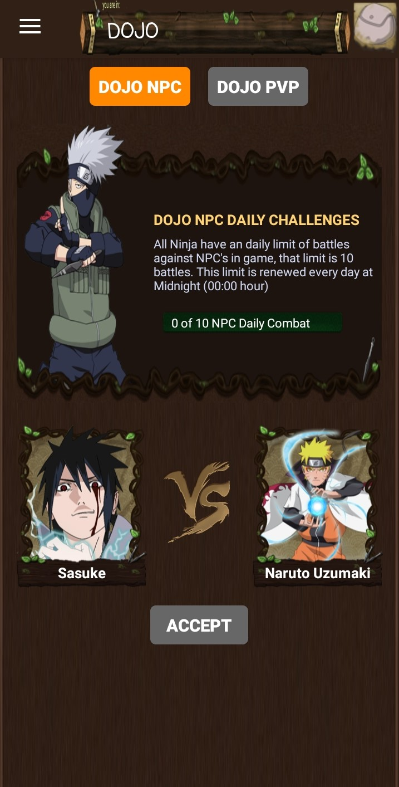
  
  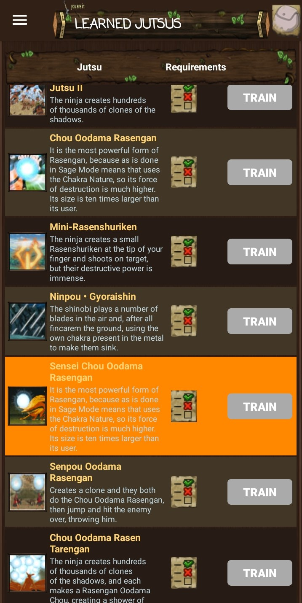
  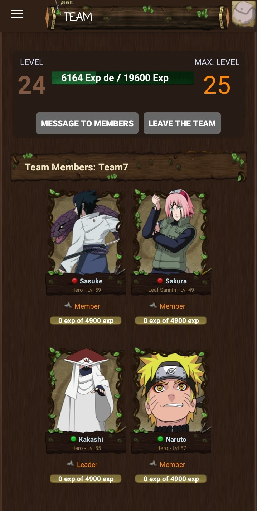
  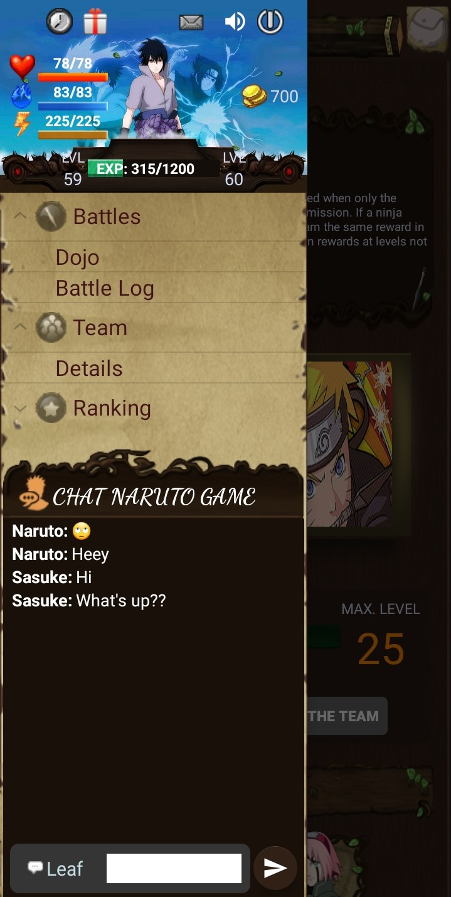

## Disclaimer
Naruto Game is a game developed by fans for fans (completely free), where players choose from some of the most attractive manga/anime characters to participate online in Naruto RPG adventures with your friends. 
Original characters and illustrations © Copyright 2002 by Masashi Kishimoto. All rights reserved

## Contribute
Any contributions to this repository are most welcome.

### Running locally

#### Prerequires
The following items should be installed in your system:

 - git command line tool (https://help.github.com/articles/set-up-git)
 - Android Studio IDE (https://developer.android.com/studio)
 
And you also should have a Firebase Account (https://firebase.google.com)

#### Steps

<ol>
  <li>
    On the command line 
    
    git clone https://github.com/guto-alves/naruto-game.git
  </li>  
  <li>Open the Project in Android Studio</li> 
  <li>Preparing Firebase
    <ul>
       
      <li>
       Access the Firebase Console and create a new Project. Add it to the cloned Android application. The most important steps in this case to add Firebase to your Android app are the steps <b>Register app</b> and Download config file (<b>google-services.json</b>) because the Firebase SDK and its dependencies have already been added to the build.gradle , if you want, you can just confirm by looking in the build.gradle files.
       

          
        
      

      </li>
      <li>
        Now still on the Firebase Console, you need to configure
        <ol>
           
          <li>
            <b>Realtime Database</b>
            - Create the Realtime Database and configure it to start in <b>test mode</b> rules. Then, initialize the database with the game status (download <a href="https://github.com/guto-alves/naruto-game/blob/master/game-status.json">game-status.json</a>) and import it into the Realtime Database).
        

        
        

          </li>
          <li>
            <b>Authentication</b> 
            - All you need to do here is to <b>enable the sign-in providers Email/Password and Google</b>, as in the image below:
            

          </li>
           
          <li>
           <b>Storage</b> 
            - Download the folder with the images (https://drive.google.com/drive/folders/1Dr2a00AzU4yEkg6e0RxLrQMUPXkzZEEQ?usp=sharing) and upload it to Firebase Storage. The structure of the folders in the Storage must be the same as the downloaded folder or you will need to change the methods of the <a href="https://github.com/guto-alves/naruto-game/blob/master/app/src/main/java/com/gutotech/narutogame/data/firebase/StorageUtils.java">StorageUtils</a> class to match the paths of the images.
            

            

          </li>
        </ol>
      </li>
    </ul>
  </li>  
   
  <li>
    That's all. With your emulator or real device connected, just run it.
  </li>
</ol>

## License
This project is licensed under the MIT License - see the [LICENSE](https://github.com/guto-alves/naruto-game/blob/master/LICENSE) file for details.
